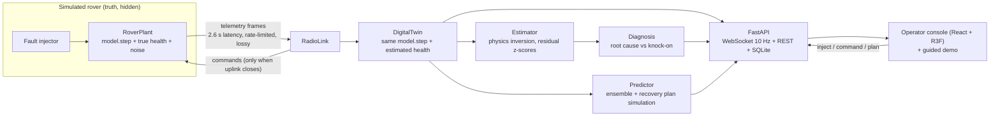

# SatTwin: Mission Digital Twin for Predictive Fault Simulation

**TECHFEST 2026–27 Space Technology Hackathon, Problem Statement ST-09**


SatTwin (repo: RoverTwin) is a **telemetry-synchronised LEO Earth-observation smallsat digital twin** (~95 min orbit, eclipse + ground-station passes; EPS / TCS / ADCS / COMMS / PAYLOAD / OBDH). Not a dashboard of canned plots: the twin runs shared physics, corrects from pass-gated frames, surfaces cause→effect cascades, predicts impact, and ranks recovery before the next uplink. **Venue demo:** local `uvicorn` on the laptop; https://rovertwin.vercel.app is the offline recorded-mission backup.

The twin never reads the simulated spacecraft's state. It only sees telemetry frames, as a ground segment would (enforced by `tests/test_twin.py`). “Show truth” in the UI is a **test harness** overlay for fidelity checks — never the twin’s belief.

Judge deck (4 traps answered): [`docs/SatTwin-ST09.pptx`](docs/SatTwin-ST09.pptx) (alias [`docs/RoverTwin-ST09.pptx`](docs/RoverTwin-ST09.pptx)).

## ST-09 cross-check

| ST-09 expect / trap | RoverTwin | Verdict |
| --- | --- | --- |
| ≥3 linked subsystems with cause–effect | 6 (EPS/TCS/GNC≈ADCS/COMMS/MOB≈PAYLOAD/DATA≈OBDH), 14 edges in `model.py` | Pass |
| Not an isolated dashboard | Twin + RadioLink sync; landing copy says twin ≠ dashboard | Pass |
| Telemetry sync | SYNCED / LOW RATE / BLIND; pass-gated AOS/LOS | Pass |
| Fault inject (battery / thermal / sensor / comms) | Test harness + guided demo | Pass |
| Predicted impact + recovery | Ensemble + ranked plans | Pass |
| Live demo: inject and see cascade | Cascade path highlight + cause→effect table + 6×6 matrix | Pass |
| Judge Q: equations linking subsystems | README + edge tooltips + correlation labels | Pass |
| Judge trap: pretty UI, no coupling | Live couplings + multi-hop paths from the model | Pass |

## What it delivers against ST-09

| ST-09 expected output | Where it lives |
| --- | --- |
| Subsystem model | `backend/model.py`: LEO orbit clock (~95 min), EPS/TCS/ADCS(GNC)/COMMS/PAYLOAD(MOB)/OBDH(DATA), eclipse + GS passes, 14 coupling equations + FDIR |
| Telemetry synchronisation | `backend/plant.py` pass-gated RadioLink and `backend/twin.py` (SYNCED / LOW RATE between passes / BLIND on missed AOS) |
| Fault injection | Battery degradation, thermal stress, sensor failure and communication loss, at any severity, instant or ramped, alone or combined |
| Cause→effect correlations | `backend/correlate.py`: 6×6 matrix, multi-hop paths, active edges on each snapshot |
| Predicted impact | A 2-hour forecast from the twin's *estimated* health. A 5-member ensemble gives uncertainty bands, and the first limit violation is called out |
| Recovery simulation | 9 recovery plans (plus an auto-combined plan) are each simulated 2 h ahead, scored on safety, comms and mission return, and executed through the real uplink |
| Optional operator narration | Local Ollama `qwen2.5:3b` explains twin correlations only — never invents physics or plans |

## Architecture



## The model

All subsystems run in one step function (`backend/model.py`, 1 s step). The equations that connect them:

**EPS (battery):** open-circuit voltage \(V_{oc}(SOC) = 22 + 7\,SOC - 1.5\,e^{-SOC/0.06}\). Battery current comes from \(P = V_{oc} I + I^2 R\), where \(R = R_0 \cdot r_{mult} \cdot e^{-0.025(T_{bat}-25)}\). Charge follows
\(\dot{SOC} = \big[(P_{sol} - P_{load} - I^2R)\,\eta - P_{leak}\big] / C\).

**TCS (two-node thermal):**
- \(C_{av}\dot T_{av} = 0.92(P_{av}+P_{sens}+P_{comm}) + 0.8P_{pay} + Q_{sun} + G_{ab}(T_{bat}-T_{av}) - \varepsilon A\,\eta_{rad}\,\sigma(T_{av}^4 - T_{sink}^4)\)
- \(C_{bat}\dot T_{bat} = I^2R + P_{leak} + Q_{heater} - G_{ab}(T_{bat}-T_{av}) - G_{env}(T_{bat}-T_{sink})\)

**GNC:** attitude error follows \(\dot\theta = |b_{gyro}| - (\theta - \theta_{floor})/\tau\), where \(b_{gyro} = b_{IMU} + 0.0025\,\max(0, T_{av}-45)\). The noise floor grows with heat and low bus voltage. Above 2° of attitude error the rover switches to visual odometry, which costs up to 16 W of extra compute power.

**COMMS (link budget):** \(M = M_0 + G_{ant} + G_{relay} - 12(\theta/10°)^2 - L_{trx} - 0.2\max(0,T_{av}-45) - L_{brownout}(V_{bus}) - L_{range}(t)\), and data rate = \(256\,\text{kbps}\cdot10^{M/10}\). Below 2 kbps there is no downlink. The uplink has a 10 dB advantage.

**Fault protection (onboard autonomy):** the rover enters SAFE mode autonomously if SOC < 18%, avionics > 72°C or battery > 55°C. It halts driving if attitude error exceeds 10°. It starts a signal search (+14 W) after 10 min without lock, and switches to transponder B on the low-gain antenna after 30 min without contact.

### Coupling graph (what the propagation panel draws)

| Edge | Mechanism |
| --- | --- |
| EPS → TCS | I²R heating and internal-short heat in the battery |
| TCS → EPS | heater power; a hot battery ages faster |
| TCS → GNC | thermal gyro bias and noise |
| TCS → COMMS | transponder derating above 45°C |
| TCS → MOB | thermal speed limit |
| EPS → GNC / COMMS | brownout raises sensor noise and cuts transmit power |
| EPS → MOB | low-SOC speed limit |
| GNC → COMMS | high-gain antenna mispointing loss |
| GNC → EPS | visual-odometry fallback compute power |
| GNC → MOB | drive halt on poor attitude knowledge |
| COMMS → EPS | signal-search power |
| COMMS → DATA | science buffer fills while the link is down |
| MOB → EPS | drive power vs terrain |

Each edge strength is computed every step from the live model state. The graph is not animated by hand.

## How the twin estimates health

Each estimate inverts one physical equation over a sliding window of telemetry:

| Hidden parameter | Estimated from |
| --- | --- |
| Battery resistance | Regression of \(V - V_{oc}(SOC)\) against \(I\) |
| Internal short (leak) | Battery thermal balance: \(C_{bat}\dot T_{bat}\) minus the known heat terms |
| Capacity | Regression of SOC against cumulative energy (slope = 1/C) |
| Radiator efficiency | Avionics thermal balance |
| IMU-A bias | Gyro innovation minus the thermally explained part |
| Transponder A loss | Link-margin residual, **or from silence**: if the model says the link should close but no frames arrive, and pointing, power and temperature are nominal, the twin attributes the loss to the transponder |

An anomaly is flagged when a rate residual exceeds 3.5σ for three consecutive windows. It clears when the updated model explains the data again (below 1.5σ). A diagnosis is only reported after it has persisted for 12 windows. A subsystem marked *root cause* has its own finding. Any other degraded subsystem is attributed as a *knock-on* through its strongest incoming coupling. When the faulty unit is bypassed (string isolated, IMU-B, transponder B), its finding stays on the list as *contained*.

## Prediction and recovery

The predictor clones the twin's state and estimated health and runs the model 2 hours ahead at 10 s steps, onboard autonomy included. Five ensemble members with perturbed health and state give the shaded bands. Each applicable plan is simulated the same way. Commands only take effect once the simulated uplink would deliver them, so a plan sent during a blackout is honestly shown as queued. Plans are scored on:
- safety (60): limit violations, power loss, soft penalties for temperatures still rising at the horizon
- comms (25): fraction of time the link is up
- mission return (15): distance driven and science returned

Irreversible actions carry a small cost. The twin also tries combining the two best single plans.

## Run it

### Cold-start check (demo laptop)

```bash
# macOS / Linux
bash scripts/smoke.sh
```

```powershell
# Windows
.\scripts\smoke.ps1
```

### Unix / macOS

```bash
python3 -m venv .venv
source .venv/bin/activate
pip install -r requirements.txt
uvicorn backend.app:app --port 8000
```

### Windows

```powershell
python -m venv .venv
.\.venv\Scripts\activate
pip install -r requirements.txt
uvicorn backend.app:app --port 8000
```

Open <http://localhost:8000>. Each browser console gets a **private** WebSocket mission; REST `/api/*` uses a shared desk for scripts. If port 8000 is taken, use `--port 8765`.

### Static UI on Vercel

`frontend/` deploys to Vercel as a static console. The served UI is the **Phase-4 / PR #1 vanilla frontend** (`index.html`, `css/`, `js/` — RoverTwin branding; no legacy `evidence.js`); optional Vite+React under `frontend/src/` is not mounted by uvicorn or Vercel by default. Without a reachable FastAPI host the site **plays a recorded battery-cascade mission** (`frontend/assets/demo-replay.json.gz`) with a banner that live control needs the backend.

```bash
npx vercel --prod
```

Point the static UI at a live backend (CORS-enabled uvicorn):

```
https://rovertwin.vercel.app/?backend=http://127.0.0.1:8000
```

`?backend=` accepts `http(s)://host:port`; also stored in `localStorage` (classic console key).

Backend CORS allows `https://rovertwin.vercel.app` and localhost. Extra origins: env `ROVERTWIN_CORS` (comma-separated).

Re-record the offline demo (after physics/UI changes):

```bash
python scripts/record_replay.py
python -m pytest -q
```

### Optional: Ollama explainer (`qwen2.5:3b`)

The OPERATOR NOTE panel narrates already-computed cause→effect paths. Diagnoses and plan ranking stay in the twin.

```bash
ollama serve
ollama pull qwen2.5:3b
```

Env (defaults shown):

| Variable | Default |
| --- | --- |
| `OLLAMA_HOST` | `http://127.0.0.1:11434` |
| `OLLAMA_MODEL` | `qwen2.5:3b` |

Endpoints: `GET /api/llm/status`, `POST /api/llm/explain`. If Ollama is down, the API returns `{ok: false, …}` and the console keeps working.

Regenerate the demo GIF / PPT (optional; needs Pillow / python-pptx):

```bash
pip install pillow python-pptx
# with the server running:
python scripts/capture_demo.py --base http://127.0.0.1:8000
# after placing stills in docs/assets/:
python scripts/make_gif.py
python scripts/build_pptx.py
```

## Demo script (3 minutes)

**Spoken (judges):** “Six coupled subsystems — EPS, TCS, ADCS, COMMS, PAYLOAD, OBDH. Twin ≠ dashboard: same physics, frames only. Watch the lit edge — that is an equation.”

1. **Landing → Start judge demo (3 min)** (`/?` → `/control?demo=1`). Coach strip walks Mirror → Break → Predict → Recover → Report.
2. **Inject battery** (or auto). Incident card + cascade hops; hop explainer shows KaTeX equations.
3. **Prediction.** Ops pill + forecast headline; timeline markers; pause on critical.
4. **Plans.** Top plan score breakdown; Compare all; Execute at next AOS.
5. **Mission report.** Root, hops, plans, outcome.
6. **Evidence** (`/evidence`) for Q1/Q3/Q4 + CSV ingest. **Model** (`/model`) for full equations.

### ST-09 on-screen map

| Question | Where |
| --- | --- |
| Q1 subsystems + equations | Cascade graph + hop popover; Evidence Q1; Model page |
| Q2 battery next + why | Incident card Next line; active EPS→TCS hop chip |
| Q3 sync vs standalone | Header sync badge; Evidence Q3; twin vs TM charts |
| Q4 validation | Evidence Q4 (`/api/validate`, `/api/backtest`) |

## Project layout

```
backend/
  model.py     coupled subsystem physics + onboard autonomy (shared by rover and twin)
  plant.py     simulated rover, fault injection, radio link
  twin.py      digital twin: sync, estimation, anomaly detection, diagnosis
  correlate.py cause→effect matrix, multi-hop paths, knock-on text
  llm.py       optional Ollama qwen2.5:3b grounded explainer
  predict.py   ensemble prediction, recovery plans, scoring
  mission.py   orchestrator (rover -> link -> twin -> operators)
  store.py     SQLite time-series store
  app.py       FastAPI: WebSocket /ws, REST /api/*, static frontend
frontend/
  index.html, css/, js/        Phase-4 / PR1 vanilla console (served by app.py + Vercel)
  vendor/                     three.js
  assets/demo-replay.json.gz  offline Vercel recorded mission
  src/                        optional Vite+React (not served by default)
scripts/
  record_replay.py   regenerate frontend/assets/demo-replay.json.gz
docs/
  SatTwin-ST09.pptx     judge slides (architecture + 4 traps)
  RoverTwin-ST09.pptx   alias of the same deck
  assets/               GIF + stills
scripts/
  smoke.sh / smoke.ps1  cold-start + pytest + /api/state
  capture_demo.py       REST-driven battery timing cues
  make_gif.py / build_pptx.py
tests/            cascade, correlate, twin, predict, llm (mocked Ollama)
```

## REST API

| Method | Path | Purpose |
| --- | --- | --- |
| GET | `/api/state` | full twin snapshot (includes `correlations`) |
| GET | `/api/prediction` | latest prediction and ranked plans |
| POST | `/api/faults` | `{"kind": "battery", "severity": 0.85, "ramp_s": 60}` |
| DELETE | `/api/faults/{kind}` | clear a fault |
| POST | `/api/commands` | `{"name": "imu", "value": "B"}` |
| POST | `/api/plans/{id}` | execute a recovery plan |
| POST | `/api/sim` | `{"speed": 60}` or `{"paused": true}` |
| POST | `/api/reset` | new mission |
| GET | `/api/llm/status` | Ollama reachability + model ready |
| POST | `/api/llm/explain` | grounded cause→effect narration from twin facts |
| GET | `/api/telemetry`, `/api/telemetry.csv`, `/api/events` | stored history |
