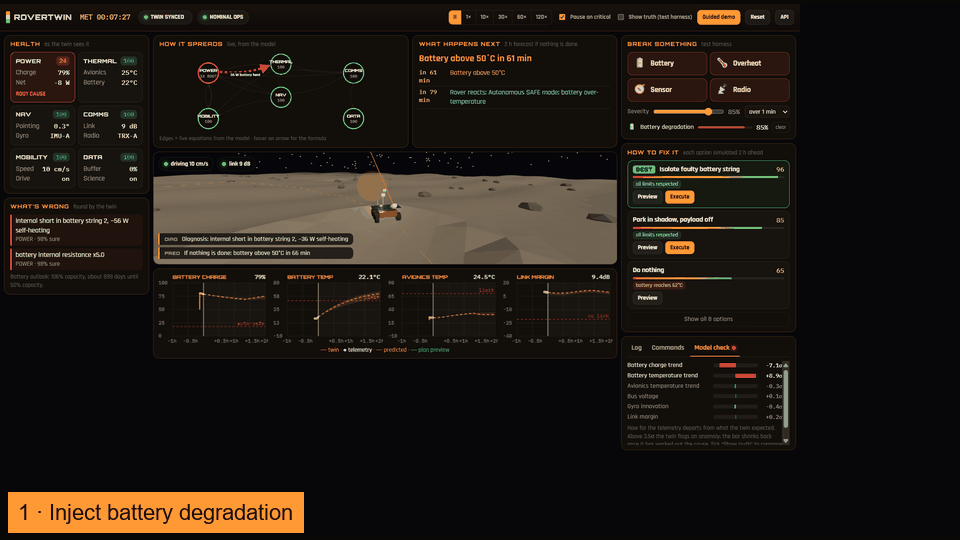
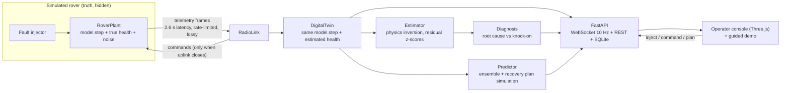

# RoverTwin: Mission Digital Twin for Predictive Fault Simulation

**TECHFEST 2026–27 Space Technology Hackathon, Problem Statement ST-09**



RoverTwin is a **telemetry-synchronised spacecraft / satellite-ops digital twin** — lunar surface asset + relay satellite (EPS / TCS / ADCS / COMMS). Not a dashboard of canned plots: the twin runs shared physics, corrects from delayed frames, surfaces cause→effect cascades, predicts impact, and ranks recovery before uplink.

The twin never reads the simulated rover's state. It only sees telemetry frames, as a ground segment would (enforced by `tests/test_twin.py`). “Show truth” in the UI is a **test harness** overlay for fidelity checks — never the twin’s belief.

Judge deck (4 traps answered): [`docs/RoverTwin-ST09.pptx`](docs/RoverTwin-ST09.pptx).

## ST-09 cross-check

| ST-09 expect / trap | RoverTwin | Verdict |
| --- | --- | --- |
| ≥3 linked subsystems with cause–effect | 6 (EPS/TCS/GNC/COMMS/MOB/DATA), 14 edges in `model.py` | Pass |
| Not an isolated dashboard | Twin + RadioLink sync; landing copy says twin ≠ dashboard | Pass |
| Telemetry sync | SYNCED / LOW RATE / BLIND; 2.6 s latency | Pass |
| Fault inject (battery / thermal / sensor / comms) | Test harness + guided demo | Pass |
| Predicted impact + recovery | Ensemble + ranked plans | Pass |
| Live demo: inject and see cascade | Cascade path highlight + cause→effect table + 6×6 matrix | Pass |
| Judge Q: equations linking subsystems | README + edge tooltips + correlation labels | Pass |
| Judge trap: pretty UI, no coupling | Live couplings + multi-hop paths from the model | Pass |

## What it delivers against ST-09

| ST-09 expected output | Where it lives |
| --- | --- |
| Subsystem model | `backend/model.py`: power (EPS), thermal (TCS), attitude (ADCS/GNC), radio (COMMS), mobility (MOB) and science data (DATA), coupled through 14 explicit equations, plus onboard fault protection |
| Telemetry synchronisation | `backend/plant.py` radio link (2.6 s latency, frame cadence limited by data rate, packet loss) and `backend/twin.py` (state blending, sync states SYNCED / LOW RATE / BLIND, uncertainty growth while blind) |
| Fault injection | Battery degradation, thermal stress, sensor failure and communication loss, at any severity, instant or ramped, alone or combined |
| Cause→effect correlations | `backend/correlate.py`: 6×6 matrix, multi-hop paths, active edges on each snapshot |
| Predicted impact | A 2-hour forecast from the twin's *estimated* health. A 5-member ensemble gives uncertainty bands, and the first limit violation is called out |
| Recovery simulation | 9 recovery plans (plus an auto-combined plan) are each simulated 2 h ahead, scored on safety, comms and mission return, and executed through the real uplink |
| Optional operator narration | Local Ollama `qwen2.5:3b` explains twin correlations only — never invents physics or plans |

## Architecture



## The model

All subsystems run in one step function (`backend/model.py`, 1 s step). The equations that connect them:

**EPS (battery):** open-circuit voltage \(V_{oc}(SOC) = 22 + 7\,SOC - 1.5\,e^{-SOC/0.06}\). Battery current comes from \(P = V_{oc} I + I^2 R\), where \(R = R_0 \cdot r_{mult} \cdot e^{-0.025(T_{bat}-25)}\). Charge follows
\(\dot{SOC} = \big[(P_{sol} - P_{load} - I^2R)\,\eta - P_{leak}\big] / C\).

**TCS (two-node thermal):**
- \(C_{av}\dot T_{av} = 0.92(P_{av}+P_{sens}+P_{comm}) + 0.8P_{pay} + Q_{sun} + G_{ab}(T_{bat}-T_{av}) - \varepsilon A\,\eta_{rad}\,\sigma(T_{av}^4 - T_{sink}^4)\)
- \(C_{bat}\dot T_{bat} = I^2R + P_{leak} + Q_{heater} - G_{ab}(T_{bat}-T_{av}) - G_{env}(T_{bat}-T_{sink})\)

**GNC:** attitude error follows \(\dot\theta = |b_{gyro}| - (\theta - \theta_{floor})/\tau\), where \(b_{gyro} = b_{IMU} + 0.0025\,\max(0, T_{av}-45)\). The noise floor grows with heat and low bus voltage. Above 2° of attitude error the rover switches to visual odometry, which costs up to 16 W of extra compute power.

**COMMS (link budget):** \(M = M_0 + G_{ant} + G_{relay} - 12(\theta/10°)^2 - L_{trx} - 0.2\max(0,T_{av}-45) - L_{brownout}(V_{bus}) - L_{range}(t)\), and data rate = \(256\,\text{kbps}\cdot10^{M/10}\). Below 2 kbps there is no downlink. The uplink has a 10 dB advantage.

**Fault protection (onboard autonomy):** the rover enters SAFE mode autonomously if SOC < 18%, avionics > 72°C or battery > 55°C. It halts driving if attitude error exceeds 10°. It starts a signal search (+14 W) after 10 min without lock, and switches to transponder B on the low-gain antenna after 30 min without contact.

### Coupling graph (what the propagation panel draws)

| Edge | Mechanism |
| --- | --- |
| EPS → TCS | I²R heating and internal-short heat in the battery |
| TCS → EPS | heater power; a hot battery ages faster |
| TCS → GNC | thermal gyro bias and noise |
| TCS → COMMS | transponder derating above 45°C |
| TCS → MOB | thermal speed limit |
| EPS → GNC / COMMS | brownout raises sensor noise and cuts transmit power |
| EPS → MOB | low-SOC speed limit |
| GNC → COMMS | high-gain antenna mispointing loss |
| GNC → EPS | visual-odometry fallback compute power |
| GNC → MOB | drive halt on poor attitude knowledge |
| COMMS → EPS | signal-search power |
| COMMS → DATA | science buffer fills while the link is down |
| MOB → EPS | drive power vs terrain |

Each edge strength is computed every step from the live model state. The graph is not animated by hand.

## How the twin estimates health

Each estimate inverts one physical equation over a sliding window of telemetry:

| Hidden parameter | Estimated from |
| --- | --- |
| Battery resistance | Regression of \(V - V_{oc}(SOC)\) against \(I\) |
| Internal short (leak) | Battery thermal balance: \(C_{bat}\dot T_{bat}\) minus the known heat terms |
| Capacity | Regression of SOC against cumulative energy (slope = 1/C) |
| Radiator efficiency | Avionics thermal balance |
| IMU-A bias | Gyro innovation minus the thermally explained part |
| Transponder A loss | Link-margin residual, **or from silence**: if the model says the link should close but no frames arrive, and pointing, power and temperature are nominal, the twin attributes the loss to the transponder |

An anomaly is flagged when a rate residual exceeds 3.5σ for three consecutive windows. It clears when the updated model explains the data again (below 1.5σ). A diagnosis is only reported after it has persisted for 12 windows. A subsystem marked *root cause* has its own finding. Any other degraded subsystem is attributed as a *knock-on* through its strongest incoming coupling. When the faulty unit is bypassed (string isolated, IMU-B, transponder B), its finding stays on the list as *contained*.

## Prediction and recovery

The predictor clones the twin's state and estimated health and runs the model 2 hours ahead at 10 s steps, onboard autonomy included. Five ensemble members with perturbed health and state give the shaded bands. Each applicable plan is simulated the same way. Commands only take effect once the simulated uplink would deliver them, so a plan sent during a blackout is honestly shown as queued. Plans are scored on:
- safety (60): limit violations, power loss, soft penalties for temperatures still rising at the horizon
- comms (25): fraction of time the link is up
- mission return (15): distance driven and science returned

Irreversible actions carry a small cost. The twin also tries combining the two best single plans.

## Run it

### Cold-start check (demo laptop)

```bash
# macOS / Linux
bash scripts/smoke.sh
```

```powershell
# Windows
.\scripts\smoke.ps1
```

### Unix / macOS

```bash
python3 -m venv .venv
source .venv/bin/activate
pip install -r requirements.txt
uvicorn backend.app:app --port 8000
```

### Windows

```powershell
python -m venv .venv
.\.venv\Scripts\activate
pip install -r requirements.txt
uvicorn backend.app:app --port 8000
```

Open <http://localhost:8000>. Each browser console gets a **private** WebSocket mission; REST `/api/*` uses a shared desk for scripts. If port 8000 is taken, use `--port 8765`.

### Static UI on Vercel

The `frontend/` folder can be hosted on Vercel for landing / walkthrough visuals. The live twin (WebSocket + FastAPI) does **not** run on Vercel — start `uvicorn` locally for inject / cascade / predict.

```bash
npx vercel --prod
```

```bash
python -m pytest -q
```

### Optional: Ollama explainer (`qwen2.5:3b`)

The OPERATOR NOTE panel narrates already-computed cause→effect paths. Diagnoses and plan ranking stay in the twin.

```bash
ollama serve
ollama pull qwen2.5:3b
```

Env (defaults shown):

| Variable | Default |
| --- | --- |
| `OLLAMA_HOST` | `http://127.0.0.1:11434` |
| `OLLAMA_MODEL` | `qwen2.5:3b` |

Endpoints: `GET /api/llm/status`, `POST /api/llm/explain`. If Ollama is down, the API returns `{ok: false, …}` and the console keeps working.

Regenerate the demo GIF / PPT (optional; needs Pillow / python-pptx):

```bash
pip install pillow python-pptx
# with the server running:
python scripts/capture_demo.py --base http://127.0.0.1:8000
# after placing stills in docs/assets/:
python scripts/make_gif.py
python scripts/build_pptx.py
```

## Demo script (3 minutes)

**Spoken (judges):** “Six coupled subsystems — EPS, TCS, GNC≈ADCS, COMMS. Twin ≠ dashboard: same physics, frames only. Watch the lit edge — that is an equation.”

1. **Landing → 3-min judge path.** Resets the mission; intro says ground ↔ relay ↔ rover and twin ≠ dashboard **before** any fault.
2. **RUN BATTERY DEMO** (or pick Battery). Residual bar spikes; diagnosis; lit multi-hop on HOW IT SPREADS (table + 6×6 matrix); OPERATOR NOTE narrates twin facts.
3. **Prediction.** Pauses on first critical (e.g. battery above 50°C); ensemble bands on charts.
4. **Decide.** Hover plans to preview; execute top plan — uplink through the relay.
5. **Mission report.** What happened / what the twin did / FDIR before uplink / how to minimise.
6. **Truth (test harness)** — optional fidelity check only; not what operators trust day-to-day.

## Answers to the judges' questions

- **Which 3+ subsystems, and what equations connect them?** Six subsystems (EPS, TCS, GNC, COMMS, MOB, DATA), connected by the equations above and drawn live as the coupling graph.
- **Inject battery degradation: where does it show up next, and why?** Battery temperature rises first (internal short plus 5× resistance means more I²R heat). Heat then conducts into the avionics through \(G_{ab}\). SOC drains faster because of the leak. If nothing is done, the battery crosses 50°C and onboard autonomy forces SAFE mode, stopping science. The twin recommends isolating the bad string: half the capacity, but no more heat.
- **Synchronised to telemetry, or a standalone simulation?** Synchronised. The twin only ingests frames that arrive over a 2.6 s, rate-limited, lossy link. It reports SYNCED / LOW RATE / BLIND, grows its uncertainty while blind, and re-locks after a blackout. Silence itself is used as evidence.
- **How did you check believability?** `tests/` checks that each fault propagates along the expected edges, and that the twin's estimates converge on the hidden truth. Headless results 40 min after onset: battery leak 56 W vs 58 W true, resistance ×5.18 vs ×5.25, capacity 62% vs 62%. Radiator efficiency 0.377 vs 0.37. Gyro bias 0.108 vs 0.108°/s. Nominal runs raise no false diagnoses. The truth harness lets anyone compare live.

## Project layout

```
backend/
  model.py     coupled subsystem physics + onboard autonomy (shared by rover and twin)
  plant.py     simulated rover, fault injection, radio link
  twin.py      digital twin: sync, estimation, anomaly detection, diagnosis
  correlate.py cause→effect matrix, multi-hop paths, knock-on text
  llm.py       optional Ollama qwen2.5:3b grounded explainer
  predict.py   ensemble prediction, recovery plans, scoring
  mission.py   orchestrator (rover -> link -> twin -> operators)
  store.py     SQLite time-series store
  app.py       FastAPI: WebSocket /ws, REST /api/*, static frontend
frontend/
  index.html, css/style.css
  js/app.js       console state, WebSocket, panels, correlations, LLM note
  js/scene.js     Three.js rover, terrain, relay orbiter, truth ghost
  js/charts.js    telemetry / twin / prediction / plan charts
  js/cascade.js   live fault-propagation graph (path highlight)
  js/edges.js     shared edge stories + equation tooltips
  js/guide.js     guided demo + mission report
docs/
  RoverTwin-ST09.pptx   judge slides (4 traps)
  assets/               GIF + stills
scripts/
  smoke.sh / smoke.ps1  cold-start + pytest + /api/state
  capture_demo.py       REST-driven battery timing cues
  make_gif.py / build_pptx.py
tests/            cascade, correlate, twin, predict, llm (mocked Ollama)
```

## REST API

| Method | Path | Purpose |
| --- | --- | --- |
| GET | `/api/state` | full twin snapshot (includes `correlations`) |
| GET | `/api/prediction` | latest prediction and ranked plans |
| POST | `/api/faults` | `{"kind": "battery", "severity": 0.85, "ramp_s": 60}` |
| DELETE | `/api/faults/{kind}` | clear a fault |
| POST | `/api/commands` | `{"name": "imu", "value": "B"}` |
| POST | `/api/plans/{id}` | execute a recovery plan |
| POST | `/api/sim` | `{"speed": 60}` or `{"paused": true}` |
| POST | `/api/reset` | new mission |
| GET | `/api/llm/status` | Ollama reachability + model ready |
| POST | `/api/llm/explain` | grounded cause→effect narration from twin facts |
| GET | `/api/telemetry`, `/api/telemetry.csv`, `/api/events` | stored history |
